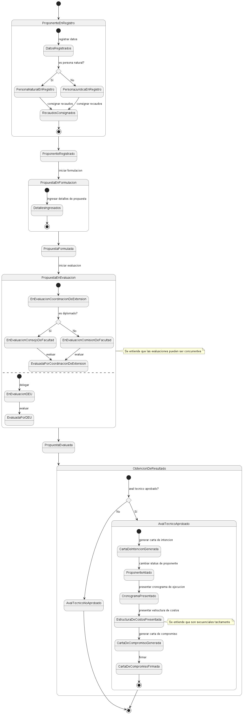
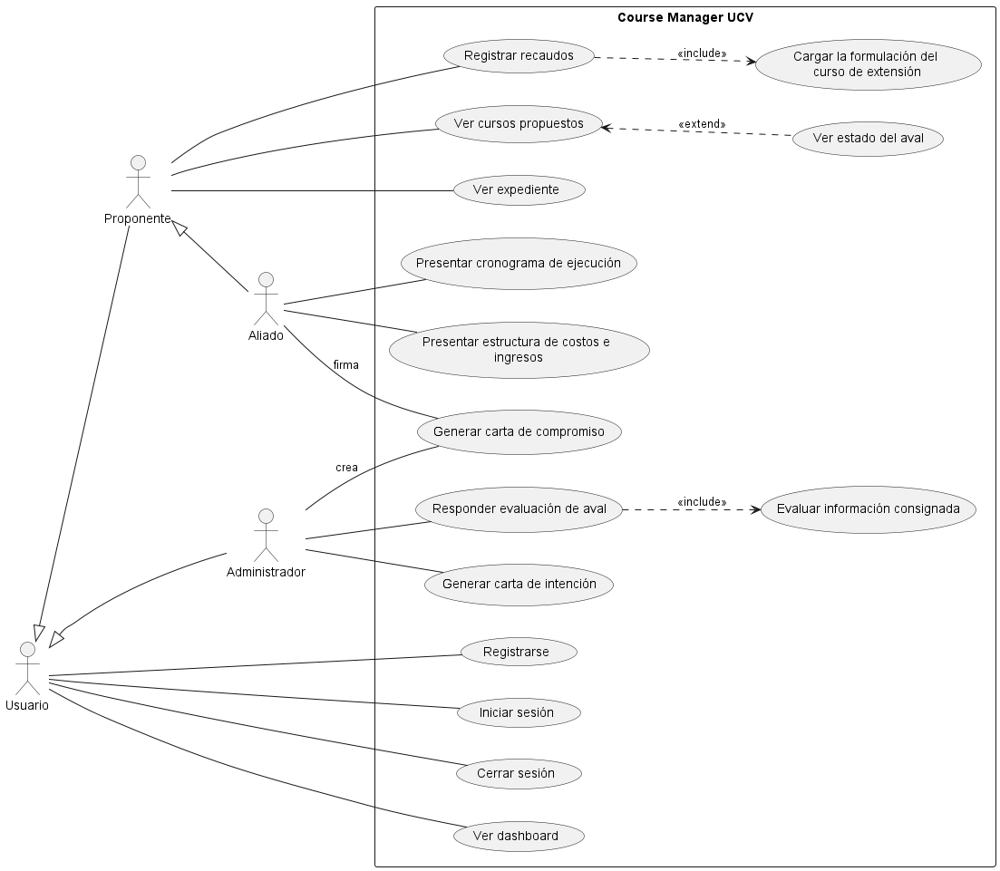
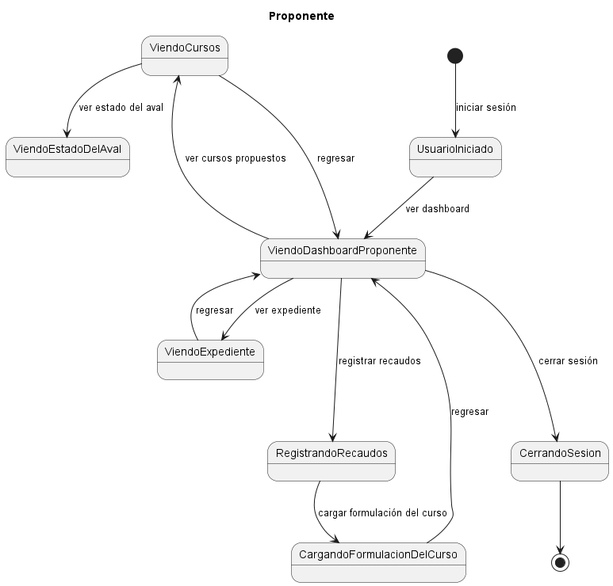
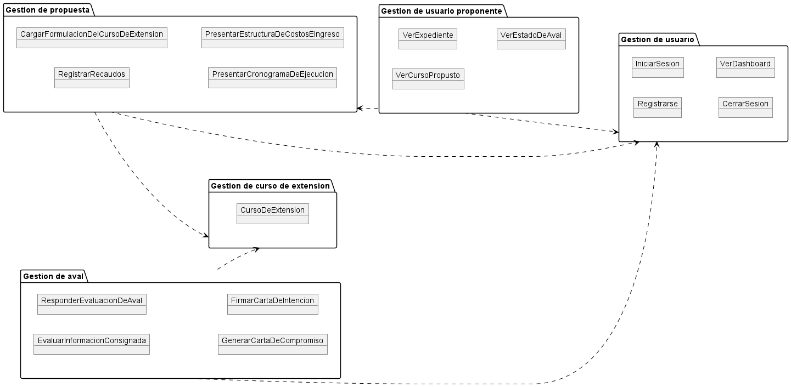

# COURSE MANAGER UCV
***

## Integrantes

1. Gustavo Berne
2. Daniel Morales
3. Thibisay Palma
4. Jesús Portillo
5. Samantha Ramirez

## Modelo del dominio

## Disciplina de requisitos

## Disciplina de análisis

