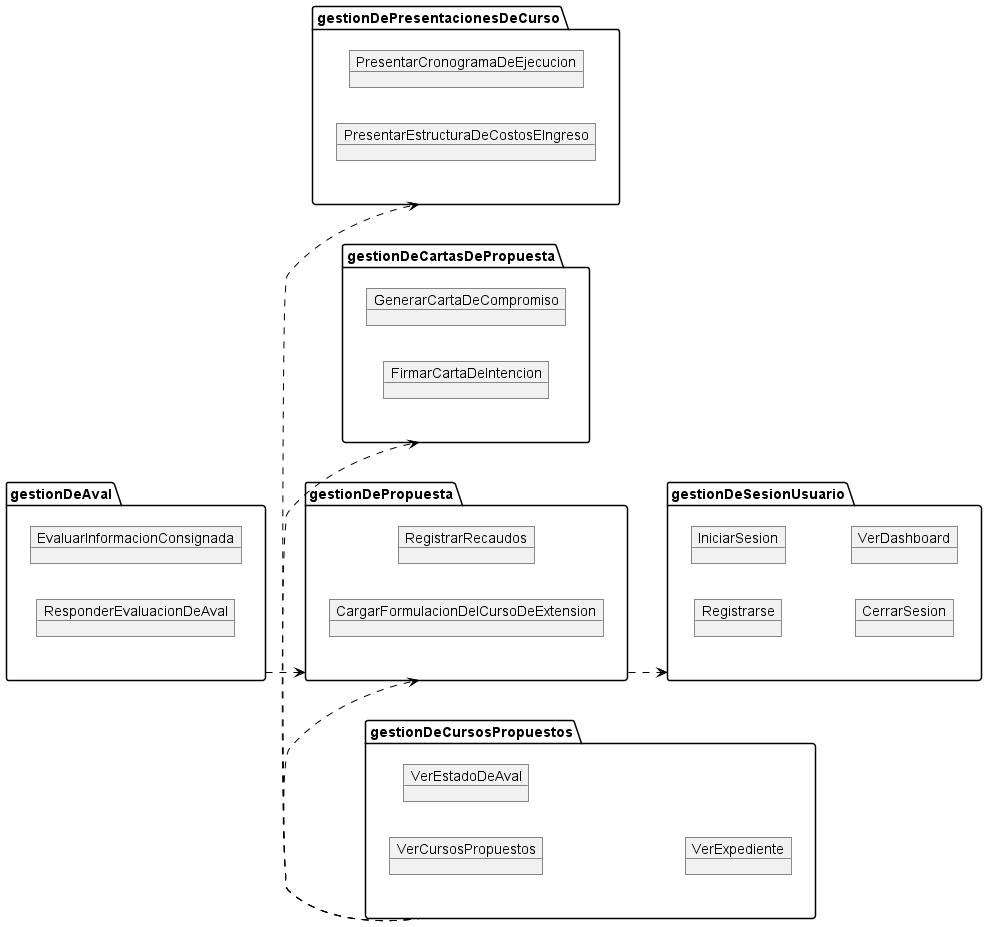
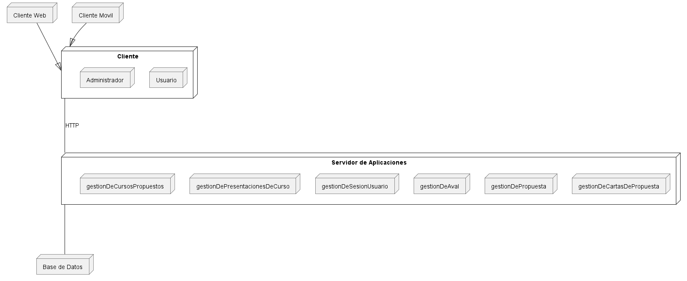

# Course manager UCV

Este proyecto es un prototipo para que la Coordinación de Extensión de la Universidad Central de Venezuela pueda manejar sus cursos de extensión y sus propuestas por determinados profesores.

## Colaboradores

- **Gustavo Berne**
- **Daniel Morales**
- **Thibisay Palma**
- **Jesús Portillo**
- **Samantha Ramirez**

## Modelo del dominio

## Disciplina de requisitos

## Disciplina de análisis
 #modificación para bajar acoplamiento 2707 

## Disciplina de diseño
 #modificación debido a nombre Servidor web 2707 

